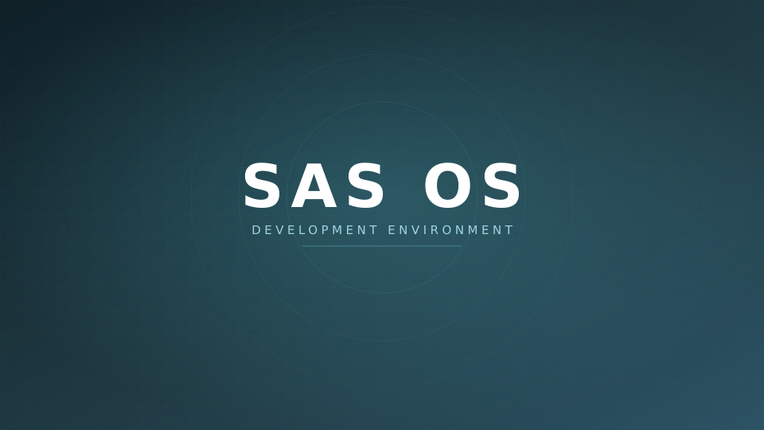

<div align="center">

# SAS OS

**A Debian-based desktop Linux with a development toolchain baked in — built from a reproducible recipe, not a hand-tweaked disk image.**

[](https://www.debian.org/)
[](https://www.lxde.org/)
[](#system-requirements)
[](#quick-start)
[](LICENSE)



</div>

---

## What this is

SAS OS is a custom Debian 12 spin aimed at people who want a machine that is ready to write code the moment the installer finishes — no post-install shopping list. It targets modest hardware: LXDE on a 2 GB machine stays responsive.

This repository is **the recipe, not the image**. Everything that ends up on the ISO is declared here in plain text — package lists, installer answers, desktop defaults, boot menus — so a build is repeatable and every change is reviewable in a diff.

The installer runs in live mode: it copies the exact filesystem you booted onto the disk. **What you see in the live session is what you get installed**, and no network is required during installation.

## Quick start

```bash
git clone https://github.com/modShik/SAS.git
cd SAS
./build.sh
```

That is the whole thing. The result lands in `dist/`:

```
dist/SAS.iso
dist/SAS.iso.sha256
```

The build runs inside a Debian container, so your host distro does not matter and nothing is installed on it. Expect **30–60 minutes** and a **~3 GB** download on a cold cache.

| Requirement | Why |
|---|---|
| Docker | The build runs in a `debian:bookworm` container |
| Membership of the `docker` group | Otherwise prefix with `sudo` |
| ~20 GB free disk | Chroot tree, package cache and the ISO itself |
| A network connection | Packages are pulled from `deb.debian.org` |

<details>
<summary><b>Options</b></summary>

```bash
./build.sh                 # containerised build (recommended)
./build.sh --clean         # discard the previous work tree and start fresh
./build.sh --keep-work     # keep the chroot afterwards, for debugging
./build.sh --native        # build directly on the host (Debian + root required)
./build.sh --help
```

`--native` exists for building on a Debian machine that already has the toolchain. It will **not** work on Ubuntu: Ubuntu ships `live-build 3.0~a57`, an old fork whose `lb config` does not understand the options used here.

</details>

## Testing the image before you trust it

The build produces an ISO; it does not boot it. Check it in a VM first:

```bash
qemu-system-x86_64 -m 2048 -smp 2 -cdrom dist/SAS.iso -boot d
```

For the UEFI path specifically, add `-bios /usr/share/ovmf/OVMF.fd`.

## Writing it to a USB stick

The image is an `iso-hybrid`, so a raw copy works. **`of=` takes the whole disk, not a partition — check it twice, `dd` will not ask.**

```bash
lsblk                      # identify the stick, e.g. /dev/sdX
sudo dd if=dist/SAS.iso of=/dev/sdX bs=4M status=progress oflag=sync
```

## What is on the image

<table>
<tr><th align="left">Desktop</th><td>LXDE with Openbox, LightDM greeter, Arc-Dark theme, Papirus icons, Breeze cursors</td></tr>
<tr><th align="left">Languages</th><td>Python 3, Node.js, Java (JDK), Go, Rust</td></tr>
<tr><th align="left">Build tools</th><td>GCC/G++, Make, CMake, Autotools, pkg-config</td></tr>
<tr><th align="left">Debugging</th><td>GDB, Valgrind, strace</td></tr>
<tr><th align="left">Editors</th><td>Geany, Vim (+GTK), Nano, Pluma</td></tr>
<tr><th align="left">Browsers</th><td>Firefox ESR, Chromium</td></tr>
<tr><th align="left">Office &amp; media</th><td>LibreOffice (Writer/Calc/Impress), VLC, GIMP, Inkscape, Audacity</td></tr>
<tr><th align="left">System</th><td>NetworkManager, Bluetooth, PulseAudio, GParted, Synaptic, non-free firmware for Intel/Realtek wireless</td></tr>
</table>

The authoritative lists live in [`config/package-lists/`](config/package-lists) — three files, one per concern, commented and grouped.

## How the build works

```
sas.conf ──────────────┐
                       ▼
config/  ──►  lb config  ──►  overlay  ──►  lb build  ──►  dist/SAS.iso
                              │                │
                 preseed substitution     debootstrap
                 wallpaper rendering      package install
                 bootloader seeding       squashfs + ISO
```

1. **`lb config`** generates a stock live-build tree in `$WORK_DIR` from the settings in `sas.conf`.
2. **Bootloader templates are seeded** from live-build's own copies. This matters: supplying `config/bootloaders/isolinux/` makes live-build use *that directory instead of* its template, so the `.c32` modules have to be there before our `isolinux.cfg` is layered on top.
3. **The overlay is merged** — `config/` from this repo is copied over the generated tree.
4. **Placeholders in `preseed.cfg`** are filled in from `sas.conf`, then verified: a leftover placeholder fails the build rather than shipping a broken installer.
5. **The wallpaper is rendered** from `assets/wallpaper.svg` locally.
6. **`lb build`** bootstraps Debian, installs the package lists, runs the chroot hook, squashes the filesystem and produces the hybrid ISO.

## Repository layout

```
.
├── build.sh                     entry point; dispatches to Docker or native
├── sas.conf                     every tunable setting lives here
├── docker/Dockerfile            pinned Debian bookworm build environment
├── assets/wallpaper.svg         wallpaper source of truth (vector, diffable)
├── scripts/
│   ├── build-native.sh          the live-build driver
│   ├── gen-wallpaper.sh         SVG → PNG rasteriser
│   └── lib/common.sh            logging helpers
└── config/                      live-build overlay
    ├── package-lists/           what gets installed
    │   ├── system.list.chroot     desktop, drivers, firmware, live-boot
    │   ├── desktop.list.chroot    apps, themes, fonts
    │   └── dev.list.chroot        the development toolchain
    ├── includes.chroot/         files copied verbatim into the image
    │   └── etc/skel/              default user profile: panel, GTK, shortcuts
    ├── includes.installer/
    │   └── preseed.cfg          installer answers (templated)
    ├── hooks/normal/            scripts run inside the chroot
    └── bootloaders/             BIOS (isolinux) and UEFI (GRUB) menus
```

## Configuration

Everything tunable is in [`sas.conf`](sas.conf). Each value can also be overridden from the environment for a one-off build:

```bash
TIMEZONE=Asia/Kolkata KEYMAP=in ./build.sh
```

| Setting | Default | Purpose |
|---|---|---|
| `ISO_NAME` | `SAS.iso` | Output filename in `dist/` |
| `ISO_VOLUME` | `SAS_INSTALLER` | ISO9660 volume label |
| `DISTRIBUTION` | `bookworm` | Debian suite to build from |
| `ARCHITECTURE` | `amd64` | Target architecture |
| `ARCHIVE_AREAS` | `main contrib non-free non-free-firmware` | Needed for Wi-Fi firmware |
| `MIRROR_HOST` / `MIRROR_PATH` | `deb.debian.org` `/debian` | Point at a local mirror to build faster |
| `LOCALE` | `en_US.UTF-8` | Installer and system locale |
| `KEYMAP` | `us` | Console/X keyboard layout |
| `TIMEZONE` | `Etc/UTC` | Preseeded timezone |
| `TARGET_HOSTNAME` | `sasos` | Default hostname offered by the installer |
| `WORK_DIR` | `$HOME/SAS-build` | live-build scratch tree — needs ~15 GB, must not be tmpfs |

## Customising the image

<details>
<summary><b>Add or remove software</b></summary>

Edit the relevant file in `config/package-lists/`, one package per line. Comments and blank lines are ignored.

```bash
echo "docker.io" >> config/package-lists/dev.list.chroot
./build.sh --clean
```

Because the installer copies the live filesystem, whatever you list here is exactly what a user ends up with.

</details>

<details>
<summary><b>Change the wallpaper</b></summary>

Edit `assets/wallpaper.svg` and rebuild — it is rasterised to 1920×1080 at build time. To preview without a full build:

```bash
./scripts/gen-wallpaper.sh /tmp/wp && xdg-open /tmp/wp/default.png
```

To ship a photograph instead, drop it into `config/includes.chroot/usr/share/backgrounds/sasos/` and point `wallpaper=` in `config/includes.chroot/etc/skel/.config/pcmanfm/LXDE/desktop-items-0.conf` at it.

</details>

<details>
<summary><b>Change desktop defaults</b></summary>

Everything under `config/includes.chroot/etc/skel/` becomes the profile of every new user: the LXDE panel layout, GTK 2/3 theming, Openbox settings and the desktop shortcuts. Edit the files directly — they are copied in verbatim, no code involved.

</details>

<details>
<summary><b>Change what the installer asks</b></summary>

`config/includes.installer/preseed.cfg` holds the debian-installer answers. Username and password are deliberately *not* preseeded so the installer always prompts for them; the root account is left locked and the first user gets `sudo`.

</details>

## System requirements

For the installed system:

| | Minimum | Comfortable |
|---|---|---|
| CPU | 64-bit x86 | 5th-gen Intel / equivalent AMD or newer |
| RAM | 2 GB | 4 GB |
| Storage | 25 GB | 50 GB |
| Firmware | BIOS or UEFI | — |

## Design notes

A few decisions worth knowing about, mostly things that bit the original prototype script:

- **The installer runs in live mode.** The earlier approach shipped a full ~3 GB live filesystem but told the installer to re-download the desktop from the network, so the installed system could silently differ from the image and installing without internet was impossible. Copying the squashfs makes the package lists authoritative and installs offline.
- **The wallpaper is generated, not downloaded.** Fetching stock photos from a CDN during the build made it non-reproducible, dependent on someone else's uptime, and murky on licensing. A checked-in SVG is diffable and always renders the same.
- **Static config is data, not heredocs.** Desktop defaults live as real files under `includes.chroot/`, where they can be linted and diffed, rather than being echoed out of a shell script.
- **`--clean` is opt-in.** The prototype deleted its work tree on every invocation; an interrupted 40-minute build now resumes instead of starting over.
- **Failures actually fail.** `lb build` is piped to `tee`, so without `pipefail` the pipeline reported `tee`'s exit status and a broken build looked successful. The build also refuses to proceed on an unsubstituted preseed placeholder or a missing ISO.
- **ISOs are not committed.** They exceed GitHub's 100 MB file limit; `dist/` is ignored. Publish images as release assets.

The original single-file prototype is preserved unmodified at [`docs/prototype.sh`](docs/prototype.sh) for provenance — see [`docs/README.md`](docs/README.md).

## Troubleshooting

| Symptom | Cause and fix |
|---|---|
| `cannot talk to the Docker daemon` | Add yourself to the `docker` group (`sudo usermod -aG docker $USER`, then log out and back in), or run `sudo ./build.sh` |
| `lb: command not found` with `--native` | The host lacks live-build. Use the container build, or install `live-build` on a Debian host |
| `lb config` rejects options with `--native` on Ubuntu | Ubuntu's `live-build 3.0~a57` is an incompatible fork. Use the container build |
| Build dies partway through fetching packages | Usually a flaky mirror. Rerun without `--clean` to resume, or set `MIRROR_HOST` to a nearer mirror |
| `No space left on device` | The chroot needs ~15 GB in `WORK_DIR`. Point it at a roomier disk, and never at tmpfs |
| Full build log | `$WORK_DIR/build.log` (`~/SAS-build/build.log` by default) |

## License

[MIT](LICENSE) for the build system in this repository.

The ISO it produces contains Debian packages under their own licences, including non-free firmware from the `non-free-firmware` archive area. SAS OS is an unofficial, independently maintained image and is not affiliated with or endorsed by the Debian Project.
